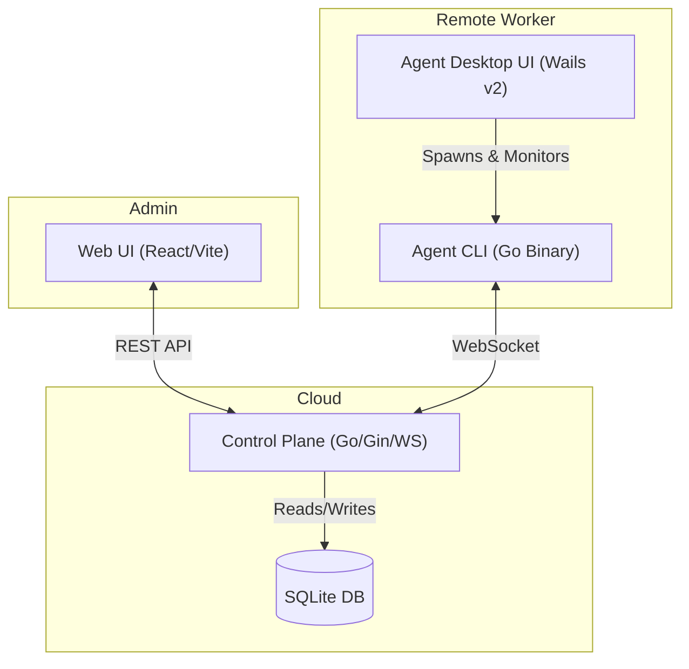
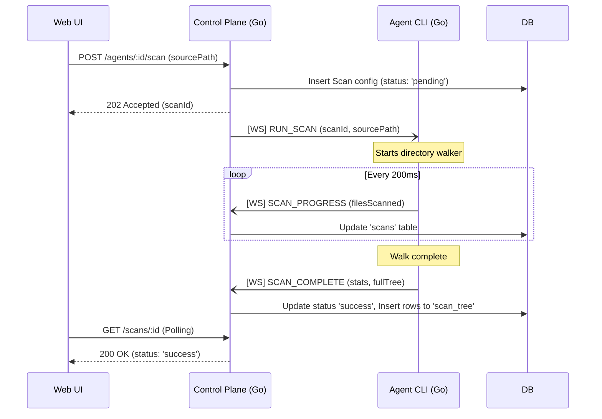

# Unified E2E Automation POC

Welcome to the **Unified E2E Automation** proof-of-concept repository. This monorepo demonstrates a robust, asynchronous agent-based architecture designed for distributed file scanning and management, fully integrated with a deep Cypress end-to-end testing suite.

## 🏗️ System Architecture

The project is composed of four distinct applications running in concert:

1. **Control Plane (`control-plane/`)**: The central Go backend providing REST APIs for the Web UI and a WebSocket hub for remote Agents. Built with `gin` and a pure-Go SQLite database (`modernc.org/sqlite`).
2. **Agent CLI (`agent/`)**: A headless Go binary deployed to remote machines. Connects to the Control Plane via WebSockets, executes local file scans (using the native Go directory walker), and streams progress payloads back.
3. **Agent Desktop UI (`agent-ui/`)**: A Wails v2 + React desktop application acting as a user-friendly wrapper around the headless Agent CLI. It manages configuration, spawns the local binary, and parsers its logs to display live WebSocket connection status.
4. **Web UI (`web-ui/`)**: A React + Vite frontend dashboard for centralized management. Users can register new agents, view connection statuses, trigger remote scans, and explore the nested results in real time.



## 🔄 Scan Execution Flow

To ensure maximum performance without blocking HTTP threads, remote scans are executed over an asynchronous WebSocket event loop. 



## 🚀 Getting Started

The entire stack is container-less for raw execution speed. All compiled binaries are scoped to the local `./bin/` directory.

### Prerequisites
- Go 1.22+
- Node 20+
- Wails CLI v2 (`go install github.com/wailsapp/wails/v2/cmd/wails@latest`)

### 1. Build & Setup
Run the setup script once to install NPM dependencies and build the Go binaries.
```bash
make setup
```

### 2. Start the Infrastructure
This compiles the Go apps and boots both the **Control Plane** API and the **Web UI** dashboard.
```bash
make up
```

### 3. Launch the Agent
You can start the agent via its Desktop application, or directly from the CLI on a separate terminal:
```bash
cd agent-ui
make dev
# -- OR --
./bin/go-agent start --id "my-test-mac" --cp-url ws://localhost:4000/ws
```

## 🧪 E2E Test Suite (Cypress)

This repository includes a sophisticated Cypress 13 end-to-end framework capable of verifying both the React DOM and the underlying Go binaries in parallel.

```bash
make e2e       # Run the whole suite heedlessly
make e2e-open  # Open the interactive Cypress runner
make ci        # Re-compile everything, clean the DB, and run e2e 100% fresh
```

### 🧠 Pure Test Isolation
To guarantee deterministic tests, the E2E suite bypasses standard APIs and connects **directly to the SQLite database**. Included in `cypress.config.js` is a `cleanDb()` Node task that runs globally *before every spec suite*. 

This task physically truncates the `agents`, `scans`, and `scan_tree` SQL tables—ensuring every E2E suite initializes against a blank slate without cross-test contamination.
